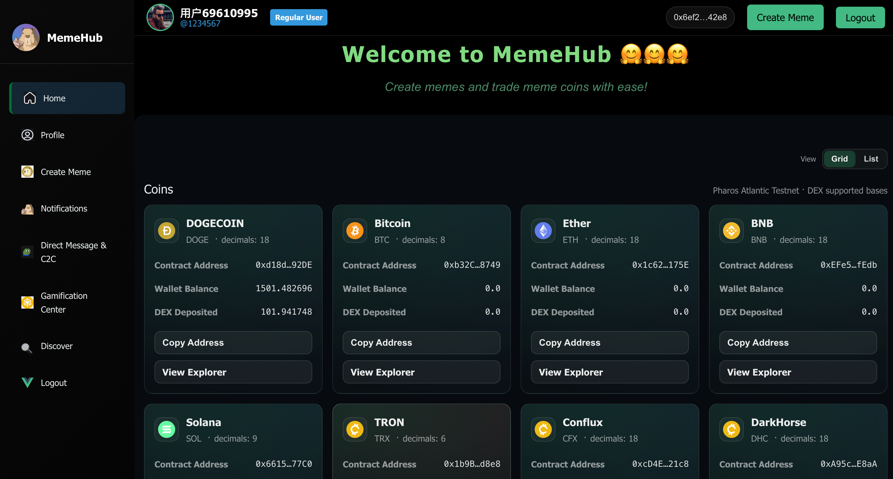
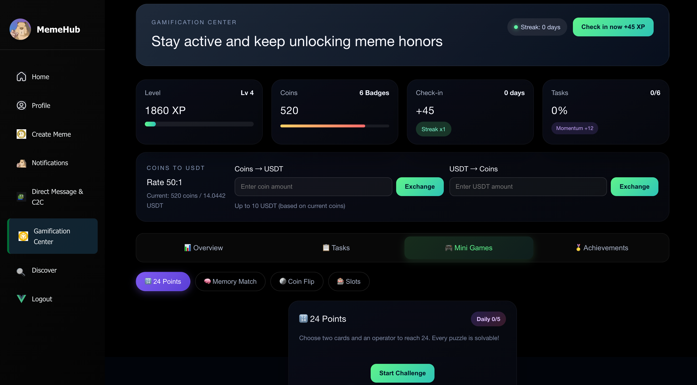
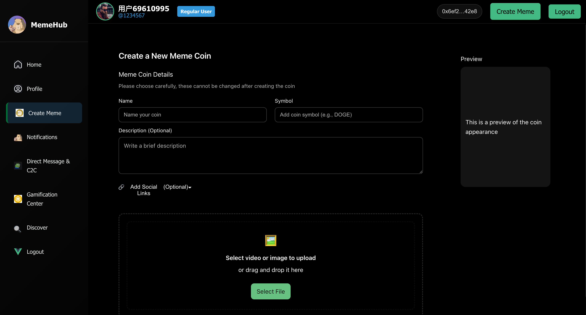
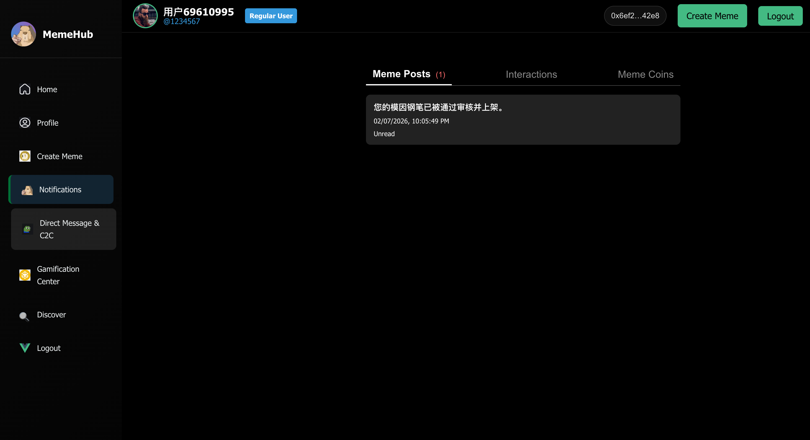
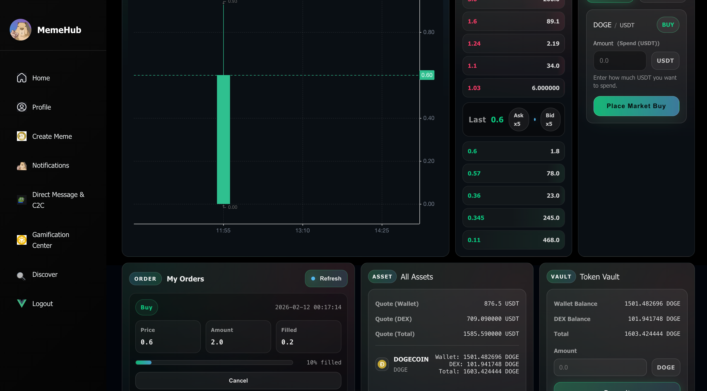
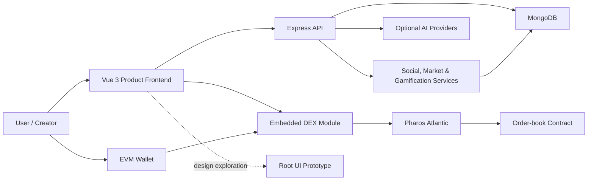
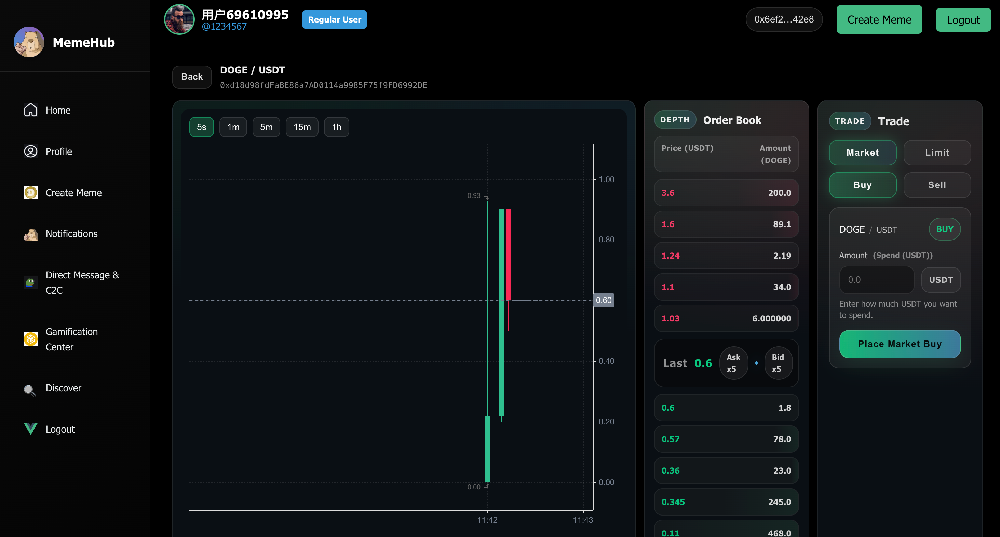
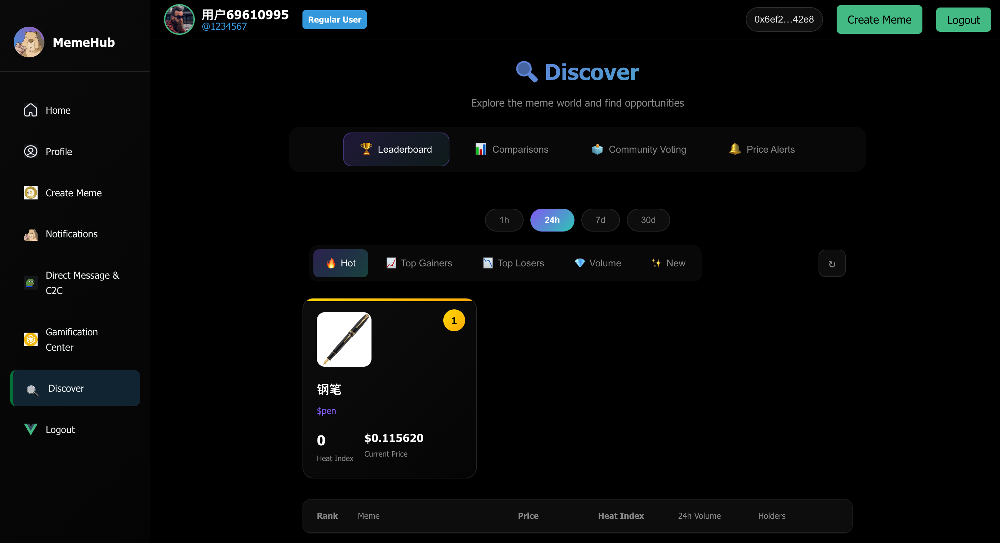
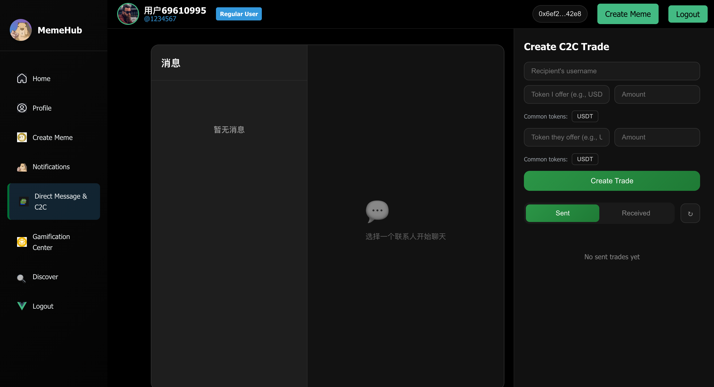

<p align="center">
  
</p>

<h1 align="center">MemeHub</h1>

<p align="center">
  <strong>把互联网的情绪做成可发现、可讨论、可激励、可交易的社区资产。</strong><br>
  <strong>A full-stack social and on-chain economy for memes, creators, and communities.</strong>
</p>

<p align="center">
  <a href="./LICENSE"></a>
  <a href="https://github.com/qinyh10300/MemeHub/actions/workflows/ci.yml"></a>
  
  
  
  
  
</p>

<p align="center">
  <a href="#english">English</a> ·
  <a href="#简体中文">简体中文</a> ·
  <a href="#architecture">Architecture</a> ·
  <a href="#quick-start">Quick Start</a> ·
  <a href="#security-and-project-status">Security</a>
</p>

> [!WARNING]
> MemeHub is an experimental research and hackathon project. The repository includes testnet-oriented Web3 integrations and has not received an independent security audit. Do not use real assets, production credentials, or sensitive personal data without a full security review.

---

## English

### What is MemeHub?

MemeHub is a full-stack social platform that treats a meme as more than a disposable image. A meme can be created, reviewed, discovered, discussed, collected, ranked, turned into a community token, and explored through an on-chain order-book interface.

The product combines three layers:

- **Social layer** — accounts, profiles, follows, comments, likes, favorites, notifications, direct messages, polls, discovery, and creator dashboards.
- **Community economy** — meme publishing, token-oriented market data, reservations, C2C trades, watchlists, price alerts, leaderboards, achievements, and gamified participation.
- **Web3 trading experience** — wallet connection, Pharos Atlantic network support, vault balances, market depth, limit-order controls, token pages, and reusable DEX components.

In short: MemeHub asks a slightly unreasonable but interesting question—what if internet culture had a product surface, a reputation system, and market infrastructure of its own?

### Product highlights

| Area | Capabilities |
| --- | --- |
| Identity | JWT authentication, profiles, avatars, follows, reviewer accounts |
| Meme lifecycle | Upload, create, review, search, discover, like, favorite, comment |
| Social | Notifications, direct messages, AI stickers, polls, C2C requests |
| Creator tools | Creator dashboard, engagement views, meme comparison, trend data |
| Gamification | Check-ins, XP, achievements, tasks, rankings, mini-game surfaces |
| Market tools | Token views, price history, watchlists, alerts, buy/sell reservations |
| Web3 / DEX | EVM wallet support, Pharos Atlantic, order book, K-line chart, vault UI |
| Optional AI | AI-assisted review, meme generation, and sticker generation providers |

### Screenshots

<p align="center">
  
  
</p>

<p align="center">
  
  
  
</p>

[Watch the product demo](./assets/video.mp4)

### Architecture



The primary application lives in [`frontend/`](./frontend), while [`backend/`](./backend) exposes the API and persists product state in MongoDB. The DEX workspace under [`frontend/src/dex_frontend/`](./frontend/src/dex_frontend) is both independently runnable and embedded into the product router through `/dex/token/:address`.

The repository also retains the newer visual design prototype at the root. It is useful for UI exploration, but the `frontend/` and `backend/` directories are the integrated full-stack product.

### Engineering notes

- **Clear runtime boundaries** — frontend, backend, embedded DEX, and UI prototype have independent package manifests.
- **Reproducible installs** — each runnable workspace includes a lockfile and uses `npm ci` in CI.
- **Automated verification** — GitHub Actions builds all three Vue/Vite workspaces and syntax-checks backend JavaScript.
- **Environment-based secrets** — credentials belong in `backend/.env`; the tracked `.env.example` contains placeholders only.
- **Generated artifacts excluded** — dependency folders, build output, runtime media, and local tool configuration are ignored.
- **Parallel-aware Web3 design** — [`PARALLEL_EXECUTION_DESIGN.md`](./PARALLEL_EXECUTION_DESIGN.md) documents state sharding, vault accounting, deterministic matching, and rollback-resistant execution ideas.

### Repository map

```text
MemeHub/
├── backend/                      Express API, MongoDB models, product services
├── frontend/                     Primary Vue 3 social and marketplace client
│   └── src/dex_frontend/         Reusable Pharos order-book trading workspace
├── src/                          Visual community UI prototype
├── assets/                       Product screenshots and demo video
├── doc/                          API, class, test, and project documentation
├── test/                         Historical backend test fixtures
├── testGen/                      AI sticker generation experiment
├── PARALLEL_EXECUTION_DESIGN.md  Web3 execution design deep dive
└── .github/workflows/ci.yml      Build and syntax verification
```

### Quick start

#### Requirements

- Node.js `20.19+` or `22.12+`
- npm
- MongoDB Community Server or MongoDB Atlas
- An EVM wallet extension for the DEX experience

Clone the repository:

```bash
git clone https://github.com/qinyh10300/MemeHub.git
cd MemeHub
```

Start the API:

```bash
cd backend
npm ci
cp .env.example .env
npm run dev
```

At minimum, configure these values in `backend/.env`:

```dotenv
JWT_SECRET=replace_with_a_long_random_secret
MONGODB_URI=mongodb://localhost:27017/MemeHub
REVIEWER_REGISTER_SECRET=replace_with_a_reviewer_secret
```

Optional AI features use `GLM_API_KEY`, `STICKER_API_KEY`, and the provider/model variables documented in [`backend/.env.example`](./backend/.env.example).

Start the integrated product frontend in another terminal:

```bash
cd frontend
npm ci
npm run dev
```

The defaults are:

- Product frontend: `http://localhost:5173`
- API server: `http://localhost:3000`
- Health check: `http://localhost:3000/api/health`

Run the root visual prototype:

```bash
npm ci
npm run dev
```

Run the DEX workspace independently:

```bash
cd frontend/src/dex_frontend
npm ci
npm run dev
```

> The current DEX configuration targets Pharos Atlantic testnet (`chainId: 688689`) and a configured contract deployment. Replace the chain and contract settings before using another environment.

### Backend API groups

The API surface is organized around:

- Authentication and reviewer registration
- Profiles, avatars, follows, and notifications
- Meme upload, review, discovery, reactions, and comments
- Token price history, buy/sell reservations, and order cancellation
- Leaderboards, comparisons, recommendations, watchlists, and price alerts
- Polls and community voting
- Direct messages, AI stickers, and C2C trades

See [`backend/src/index.js`](./backend/src/index.js) for the current route registry and [`doc/API-document.md`](./doc/API-document.md) for the historical API documentation.

### Security and project status

Before production use:

1. Rotate any credentials that may have appeared in historical public commits.
2. Add authorization middleware consistently across protected API routes.
3. Validate uploads by MIME type, size, content, and storage destination.
4. Add automated API, database, and end-to-end tests.
5. Move chain IDs, RPC endpoints, ABIs, and contract addresses into environment-specific configuration.
6. Audit token accounting, reservation logic, C2C settlement, and smart-contract interactions.
7. Define privacy, moderation, abuse-reporting, and data-retention policies.

### Roadmap

- [ ] Add API integration tests and browser-level end-to-end coverage
- [ ] Introduce typed request/response contracts
- [ ] Add Docker Compose for MongoDB, API, and frontend development
- [ ] Externalize all frontend and chain configuration
- [ ] Add moderation queues and abuse-reporting workflows
- [ ] Connect the DEX UI to versioned, audited contract deployments
- [ ] Add observability, rate limiting, and production deployment guides

---

## 简体中文

### MemeHub 是什么？

Meme 通常只有两种命运：火三天，或者躺进收藏夹吃灰。

MemeHub 想给它第三种命运——**让一张图从“哈哈哈”开始，继续变成作品、话题、社区身份、创作者声誉，甚至是一种可以被观察和交易的链上资产。**

这是一个把社交平台、创作者工具、社区激励与 Web3 交易体验揉在一起的全栈项目：

- 你可以发布和发现 Meme，也可以点赞、收藏、评论、关注与私聊；
- 创作者可以查看趋势、参与审核、经营主页和观察社区反馈；
- 用户可以完成任务、签到、解锁成就、参加投票与小游戏；
- Meme 可以关联代币、行情、预约订单、关注列表和价格提醒；
- 内置 DEX 模块可以连接 EVM 钱包，在 Pharos Atlantic 测试网上展示盘口、K 线、Vault 余额与限价交易界面。

它不是“给论坛加一个钱包按钮”，而是在认真探索：**当互联网文化拥有自己的身份系统、激励机制和市场基础设施时，会发生什么？**

### 核心能力

| 模块 | 已实现能力 |
| --- | --- |
| 身份系统 | JWT 登录、用户主页、头像、关注关系、审核员角色 |
| Meme 生命周期 | 上传、创作、审核、搜索、发现、点赞、收藏、评论 |
| 社区互动 | 通知、私信、AI 表情包、投票、用户间 C2C 请求 |
| 创作者工具 | 创作者面板、趋势数据、Meme 对比、社区反馈 |
| 游戏化 | 签到、经验值、任务、成就、排行榜、小游戏界面 |
| 市场功能 | 代币页面、价格历史、关注列表、价格提醒、预约订单 |
| Web3 / DEX | EVM 钱包、Pharos Atlantic、订单簿、K 线、Vault 界面 |
| 可选 AI | AI 辅助审核、Meme 生成与表情包生成服务 |

### 产品截图

<p align="center">
  
  
</p>

<p align="center">
  
  
  
</p>

[观看产品演示视频](./assets/video.mp4)

### 技术架构

上方架构图展示了 MemeHub 的主要运行路径：

- `frontend/` 是完整产品前端，负责社交、创作、市场与游戏化体验；
- `backend/` 提供 Express API，通过 MongoDB 保存用户、Meme、订单、消息、通知与社区状态；
- DEX 工作区既可以独立运行，也通过 `/dex/token/:address` 嵌入主前端；
- 钱包负责链上签名，DEX 模块读取 Pharos Atlantic 和订单簿合约；
- AI 审核、Meme 生成和表情包生成是可选能力，未配置密钥时不应影响基础社交功能；
- 根目录 `src/` 保留了一套更偏视觉探索的社区 UI 原型。

### 为什么现在更像一个工程仓库？

- **主线明确**：完整产品代码进入 `main`，不再让默认分支保持空白。
- **边界清楚**：后端、产品前端、DEX 与视觉原型各自拥有独立依赖和启动方式。
- **可重复构建**：所有主要工作区都保留 lockfile，并在 CI 中使用 `npm ci`。
- **自动检查**：每次推送和 Pull Request 都会构建三个前端工作区并检查后端语法。
- **配置安全**：仓库只提交 `.env.example`，密钥通过本地 `.env` 注入。
- **生成物退场**：`node_modules`、构建目录、运行时图片和个人工具配置不再进入主线。
- **设计有据可查**：并行执行、状态拆分、Vault 账本与确定性撮合思路记录在 [`PARALLEL_EXECUTION_DESIGN.md`](./PARALLEL_EXECUTION_DESIGN.md)。

### 目录结构

```text
MemeHub/
├── backend/                      Express API、MongoDB 模型与业务服务
├── frontend/                     Vue 3 社交与 Meme 市场主前端
│   └── src/dex_frontend/         可独立运行的 Pharos 订单簿交易模块
├── src/                          社区视觉与交互原型
├── assets/                       产品截图与演示视频
├── doc/                          API、类设计、测试与项目文档
├── test/                         历史后端测试材料
├── testGen/                      AI 表情包生成实验
├── PARALLEL_EXECUTION_DESIGN.md  Web3 并行执行设计说明
└── .github/workflows/ci.yml      构建与语法检查
```

### 五分钟启动

环境要求：

- Node.js `20.19+` 或 `22.12+`
- npm
- 本地 MongoDB 或 MongoDB Atlas
- 如需体验 DEX，请安装 EVM 钱包扩展

克隆仓库：

```bash
git clone https://github.com/qinyh10300/MemeHub.git
cd MemeHub
```

启动后端：

```bash
cd backend
npm ci
cp .env.example .env
npm run dev
```

最小环境变量：

```dotenv
JWT_SECRET=请替换为足够长的随机字符串
MONGODB_URI=mongodb://localhost:27017/MemeHub
REVIEWER_REGISTER_SECRET=请替换为审核员注册密钥
```

AI 功能使用的完整可选变量见 [`backend/.env.example`](./backend/.env.example)。不要把真实密钥提交到 Git。

另开终端启动主前端：

```bash
cd frontend
npm ci
npm run dev
```

默认地址：

- 产品前端：`http://localhost:5173`
- 后端 API：`http://localhost:3000`
- 健康检查：`http://localhost:3000/api/health`

运行根目录视觉原型：

```bash
npm ci
npm run dev
```

单独运行 DEX 工作区：

```bash
cd frontend/src/dex_frontend
npm ci
npm run dev
```

> 当前 DEX 配置指向 Pharos Atlantic 测试网（`chainId: 688689`）及一个指定的合约部署。切换网络或合约前，请同步更新 RPC、ABI、合约地址与安全假设。

### 后端接口范围

当前 API 覆盖：

- 注册、登录、密码重置与审核员注册
- 用户主页、头像、关注和通知
- Meme 上传、审核、发现、搜索、互动和评论
- 代币价格、买卖预约、订单取消和用户订单
- 排行榜、Meme 对比、推荐、关注列表和价格提醒
- 社区投票与 Poll
- 私信、AI 表情包和 C2C 交易

路由注册以 [`backend/src/index.js`](./backend/src/index.js) 为准；[`doc/API-document.md`](./doc/API-document.md) 保留了历史 API 文档。

### 安全与项目状态

在真正部署前，至少还需要：

1. 轮换任何可能在历史公开提交中出现过的凭据。
2. 为需要保护的 API 统一补齐身份认证和权限校验。
3. 对上传文件执行 MIME、大小、内容与存储路径验证。
4. 增加 API、数据库、浏览器端到端测试。
5. 把链 ID、RPC、ABI 和合约地址迁移到分环境配置。
6. 审计代币账本、预约订单、C2C 结算和链上交互。
7. 建立隐私、内容治理、举报和数据保留规则。

### 路线图

- [ ] 增加 API 集成测试和浏览器端到端测试
- [ ] 为前后端接口建立类型化契约
- [ ] 使用 Docker Compose 统一 MongoDB、API 与前端环境
- [ ] 完成所有前端和链上参数的配置外置
- [ ] 增加内容治理与用户举报工作流
- [ ] 将 DEX 接入经过版本管理和安全审阅的合约部署
- [ ] 增加可观测性、限流和生产部署文档

---

## Contributing / 参与贡献

Issues and pull requests are welcome. Please include reproducible steps, screenshots for UI changes, and tests or verification notes for behavior changes.

欢迎提交 Issue 与 Pull Request。界面修改请附截图；行为修改请提供复现步骤、测试或验证说明；涉及订单、余额和链上交互时，请明确异常边界与失败处理。

## License / 许可证

Released under the [MIT License](./LICENSE). 本项目基于 [MIT License](./LICENSE) 开源。

